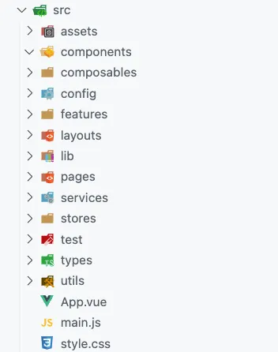
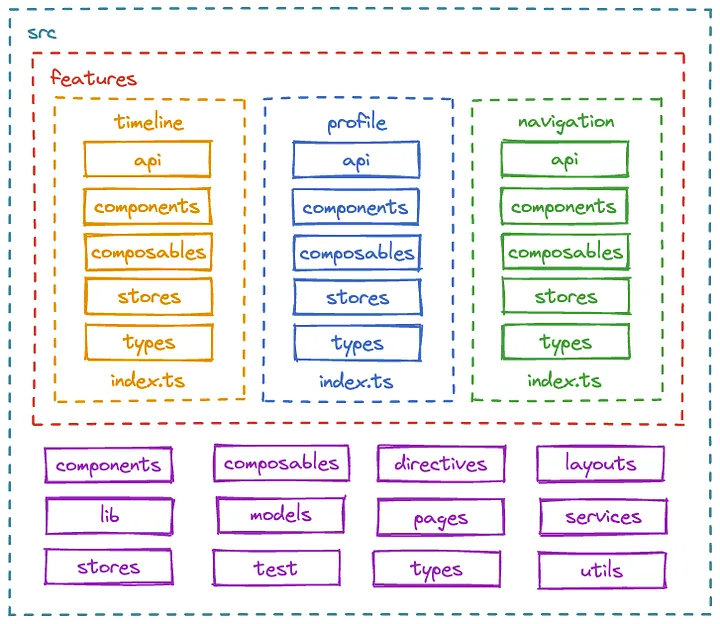

## Create project structure

mkdir -p src/{composables,layouts,pages,utils,assets,config,lib,services,test,components,features,stores,types}

Shared composables, components, services, stores... should separate inside features folder. But, as divide by features require effort, shared folders is a place to put temporary files

## Component principle

1. Component must be consistent. Same input always create same output
2. Component haven't have side effect, which change outside state. Instead, move those change state to property, change and pass it from outside (Which again, may need to move property up to its parent => Create and use property at same place). In case of complex property passing tree, we can use central data management tool like Redux
3. With data that belong to a component, we can change it as long as change in this component only
4. With functional programming style, high order function like map, filter, reduce is helpful
5. When thing need to be change, using predefined function in event handler allows data change after rendering (It's still data changing though. However, change after rendering is easier to manage). In React, these are useEffect

## UI as a tree

UI is usually describe in form of a tree of components. Pure html use DOM, CSS use CSSOM, React create its own virtual tree (render tree).

## Security

A consistent UI tree allows client easily understand the structure of frontend. This make developer better, but make created content vulnerable. User can read html DOM tree and create crawl tool to get data and clone source code of website

## Event handler

1. General
   React need to run in different browsers with different feature. Though browsers have common but can be different too. Just like Java, React create a wrapper SyntheticEvent object to normalize even handle interface.
   By move browser compatibility logic to a place, which is handle internal by React library, developers can concentrate in UI logic
   Usually, general component (Button) does not contain event handler logic but style, specific component (UploadButton) contains general component and attach event handler logic
   With React component, passed props is just props. But with built-in element, event handler is register to DOM node. At the same time, property name is different between detail components and general components
   In conclusion, passed event handler to React component can be any name as normal property while event handler pass to HTML element must be correct as convention
2. Event propagation
   Event move up from component to root when it happen in a child node. However, a node can choose to stop event propagation chain when it handle the event (event object is passed to event handler).
   The event passed to event handler is the object belong to component. However, calling e.stopPropagation() prevent parent component receive event because e wil not call some function like next() in Express to pass to parent object.
3. Some elements's default event handler
   Form and some element has default handler when we interact. It;s may not what we want, so developer can disable those feature if needed
4. State changing using event handler
   Side effect should put into event handler. However, event handler modify local state is bad. Actually, when rerender, the state of local variable is reset cause the function is called again. The second problem is that React doesn't even know it must rerender at all.
   Solving this problem by providing a state that persist through rerender and a callback to change state that allow React know it must rerender. The state is still local to component => 2 same components will have different state

## React mechanism

JSX code define virtual DOM tree. React manages a list of components (fiber nodes) and their associated states (component node + state + link to DOM node + link to virtual DOM node). The virtual DOM affects the fiber nodes by providing a description of the UI. Hook allow to change internal state. Using the components and their states, React efficiently reflects changes to the real DOM.
Change to DOM will be sync by browser rendering
A React component define by its function definition too, so even if 2 function return same structure, the component doesn't recognize it and will treat as a new component. But, if we create jsx component using conditional if (condition) <A/> else <A/>, the virtual DOM created will have node with same definition with old component (from a same function) => Not rerender
However, we can modify this default behavior using "key" property in component => Separate component. And because key is used to determine child component, it just need to unique in parent component only
NOTE: Using key allow to move component around and its state still remain

NOTE: When use setState method with object value, React may internal not replace old state object to new object but just copy value only => Case use state object as component key, rerender but React treat component is still the same key

## React rendering optimization

Rendering is not the process of update state variable and it change UI. UI is a snapshot of rendering (call the function component). When state change and React known there is state change, it queue the rendering process. Then the function component is called and return component with new state. Virtual DOM is updated and sync to UI
The state should always through setState function, even if the new state is an object or array => Need functional programming method or it is easily to make mistake
The rendering is "queued" means that there is a lag in UI if there is too much rendering request
With high level component that change state frequently, it cause massive performance cost cause React rerender recursive to the leaf
With just update needed components, React allow continuously render a component while interact with another component

## State management

UI created by pure html and vanilla javascript is hard to manage state change. Each new code need to check all other code to confirm new code will not break exist code logic. Because UI include many state, without a state management, the UI can lead to multiple states set at the same time (which is wrong)
Build UI as components, with each component have its own state allow easier management. Remove redundant states and manage remain state will be easier
Create a state machine for UI is perfect

1. Create needed states for variables. We can use single state for each variable or gather multiple variables into one state
2. Define "state" in state machine for UI life circle. This allows us to handle each state separately => We need one only. With variable states that can replace life circle state, remove that state from life circle and use variable state instead

## Reducer

Instead of out handle state logic with the component function, which lead a big ball of mud, separating view and logic can make source code easier to manage. The trade off is create a function that quite similar with event handler at first sight. Event handler will dispatch (pass action to reducer) and done, even when state change logic become complex, event handler keeps small size. All logic locate in reducer.
Another advantage for this approach is TESTING. When developing, developer need to design code to test. Attach logic with UI in a jsx file will make it way more harder to test feature than test pure state change logic in Reducer
Finally, a action is a interaction that change UI, not a fraction of it (when user submit form, should use submit action instead multiple change field actions)
